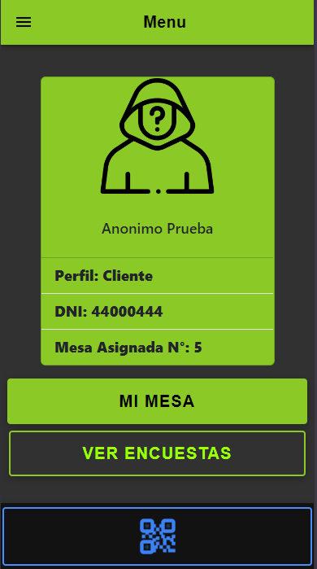
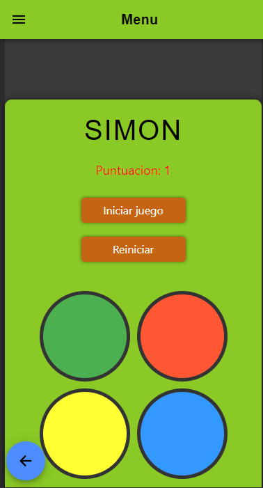

# TeraChadsRedemptions-2024

## Link al Trello
## ***[Trello](https://trello.com/b/M7PC1qRI/los-programadores-pps)***

**Objetivos**

> ***Lograr una aplicación utilizando el hardware del dispositivo móvil para la gestión de información, enfocada en la experiencia de usuario.*** 
> ***El enfoque va a estar dado por los usuarios de un RESTAURANTE, el cual apunta todos sus esfuerzos en mejorar la utilización de su servicio por medio de una aplicación para celulares.***

## Icono de la aplicacion
![Icono app][icono-app]

[icono-app]: ./src/assets/imagenes/icon.png

## Splashscreen de la aplicación
![Splashscreen][splash-app]

[splash-app]: ./resources/splash.png

# Integrantes del equipo

ALFA

### NIEVA JULIÁN

**Objetivos a desarrollar**

| Estado|    Tareas              |
| ----- |   -------              |
|   ✔️ | Funcionalidad de Login |
|   ✔️ | Splashscreen animado|
|   ✔️ | Realizar pedidos|
|   ✔️ | QR de propina|
|   ✔️ | Push Confirmar realizacion del pedido|
|   ✔️ | Push Consultar al mozo|
|   ✔️ | Encuesta de Cliente|
|   ✔️ | Juego para obtener 15% de descuento|  

***[Branch de ALFA](https://github.com/JulianNieva/TeraChadsRedemptions-2024/tree/alfa)***

-----

BETA

### D'ANGELO TOMAS

**Objetivos a desarrollar**

| Estado|    Tareas              |
| ----- |   -------              |
|   ✔️ | Splashscreen aplicación     |
|   ✔️ | QR de ingreso al local|
|   ✔️ | Confirmar pedidos|
|   ✔️ | Push Confirmar pedido|
|   ✔️ |  Juego para obtener 10% de descuento| 

***[Branch de BETA](https://github.com/JulianNieva/TeraChadsRedemptions-2024/tree/beta)***

-----

GAMMA

### GRANADILLO JERÓNIMO

**Objetivos a desarrollar**

| Estado|    Tareas              |
| ----- |   -------              |
|   ✔️ | Icono aplicación      |
|   ✔️ | Esqueleto Login      |
|   ✔️ | Alta de Clientes |
|   ✔️ | Agregar un nuevo cliente registrado|
|   ✔️ | Ingresar al local|
|   ✔️ | QR de la mesa|
|   ✔️ | Push Ingreso al local
|   ✔️ | Push Agregar cliente nuevo|
|   ✔️ | Juego para obtener 20% de descuento| 
|   ✔️ | Grafico encuesta de cliente| 

***[Branch de GAMMA](https://github.com/JulianNieva/TeraChadsRedemptions-2024/tree/gamma)***

 

# Demostración de la aplicación

## Demostración funcionalidad Push Notification
>Este es un ejemplo de la funcionalidad Push Notification en la aplicación

# Login e Inicio Rápido

# Funcionalidades del clientes
>El cliente es el enfoque de esta aplicación, podra realizar una serie de acciones dentro la misma

### Registro Cliente
>El Cliente se podra registrar para que luego sea aceptado por el *Supervisor o Dueño*

### Home y Menu de Cliente

### Entrar a la fila y Encuestas
> El Cliente puede ingresar a la fila escaneando el QR del ingreso al local. Mientras se encuentra en espera, a que el *Metre* le asigne una mesa, tiene la posibilidad de acceder a las encuestas de otros Clientes.

## Home con Mesa asignada

> Una vez que el *Metre* le asigno una mesa, se vera reflejado el cambio en el Home

## Vista de Mesa
> En la Mesa, el Cliente podra realizar una serie de acciones, siempre y cuando se escanee el QR de su mesa asignada

### Chat entre Mesa y Mozo
> El Cliente puede realizar consultas al Mozo mediante el chat

### Menu de Productos
>El Cliente, cuando tiene esta en la vista de su mesa, escaneando el QR, se le presentara el Menu que dispone el Restaurante. Donde podra agregar o quitar productos a su solicitud

### Cambios de estados del Pedido
> Cuando su Pedido cambio de estado podra ver el mismo en la vista de su mesa escaneando el QR de la misma

### Vista de Juegos
> El Cliente tiene la posibilidad de Jugar unos juegos para obtener un descuento a su pedido, siempre y cuando gane en el primer intento

### Vista de completar Encuesta
> El Cliente puede completar una encuesta donde se le realizan distintas consultas sobre el Restaurante. Asi mismo, podra tomar fotos con respecto a la misma

### Vista de Cuenta y Propina
> El Cliente, cuando decide solicitar la cuenta, apretara un boton donde se le cambiara la vista y se le muestra detalladamente el pedido realizado, y podra realizar el pago de dos formas distintas. Asimismo, podra agregar una propina siempre y cuando lea el QR correspondiente

# Funcionalidades de los empleados

## Vista de Mozo
> El Mozo cumplira distintas funcionalidades a lo largo de la aplicación

## Home y Menu de Mozo

### Chat entre Mozo y Mesa
> El Mozo dispondra de una sala de chat, donde podra responder a consultas de las distintas mesas

### Listado de Pedidos
> El mozo dispondra de una vista, donde se le presentaran los distintos pedidos segun el estado en el que se encuentren

## Vista Supervisor/Dueño
> El Supervisor o Dueño, deberan aprobar o desaprobar *Clientes* que se registren por primera vez en la aplicación.

### Home y Menu de Supervisor y Dueño
 

### Vista de Clientes pendientes de aprobación, aceptados y rechazados

 

## Vista Metre
>El Metre debera asignar a una mesa a aquellos *Clientes* que se encuentren en la lista de espera, siempre y cuando escanearon el codigo QR para ingresar a la fila
### Home y Menu del **Metre**

### Vista de Clientes en fila y con mesa asignadas

------
## Vista Bartender
>El Bartender tiene la funcionalidad de completar con los pedidos que le sean aceptados por parte del *Mozo*. Tendra un listado de los pedidos que se le fue confirmado y por su parte tendra que marcar como completado

### Home y Menu del **Bartender**
 

### Vista de pedidos pendientes y terminados

## Vista Cocinero
>El Cocinero tiene la funcionalidad similar al del Bartender. Donde recibe pedidos confirmados por el *Mozo*, y se les sera mostrado en un listado, donde por su parte, marcara como completado

### Home y Menu del **Cocinero**
 

### Vista de pedidos pendientes y terminados

# Codigos - QRs

## QR Ingreso

[ingreso]: ./imagenes_readme/imagenes-qrs/qr_ingreso.png
![Icono app][ingreso]

## QRs Mesas
### Mesa 1

### Mesa 2

### Mesa 3

### Mesa 4

### Mesa 5

## QR Pagar 

## QRs de la Propina

### Mala - 0% de propina
 

### Regular - 5% de propina
 

### Buena - 10% de propina
 

### Muy Buena - 15% de propina
 

### Excelente - 20% de propina
 